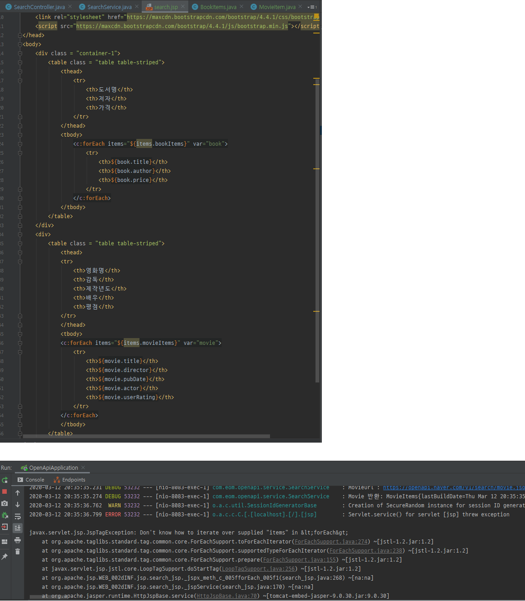

영화/도서 리뷰 사이트
=====
* [영화/도서 리뷰 사이트](https://github.com/nara1030/spring-board)의 JSP 버전
* 프론트를 따로 분리(React)하려 했으나 쉽지 않아 익숙한 JSP로 먼저 접근
- - -
## 목차
1. [개발환경](#개발환경)
2. [기록](#기록)
3. [참고](#참고)

## 개발환경
```txt
- Java 8
- Spring Boot 2.2.3
- Gradle
- JSP
```

##### [목차로 이동](#목차)

## 기록
1. JSP 사용 위한 프로젝트 구조  
	```txt
	└─ project
	    ├─ build
		├─ src
		│   ├── java
		│   └── com.eom.openapi
		│        ├── controller
		│        │    └── HomeController.java
		│        ├── service
		│        │    └── HomeService.java
		│        └── OpenApiApplication.java
		├─ resource
		│   ├── static
		│   └── application.yml
		└─ webapp
		    └── WEB-INF
			     └── jsp
				      └── home.jsp
	```
2. @RestController → @Controller  
	```txt
	- JSP, 즉 View단으로 데이터를 넘겨주기 위해 @Controller 사용
	- 넘어온 데이터는 JSP에서 EL/JSTL을 통해 화면 출력
	
	- @Controller: Restful하지 못한 건가?
	```
3. HTML 문서 Table 스타일 적용  
	```txt
	- head 태그 안에 다음 두 가지 추가
	   1. <link rel="stylesheet" href="https://maxcdn.bootstrapcdn.com/bootstrap/4.4.1/css/bootstrap.min.css">
	   2. <script src="https://maxcdn.bootstrapcdn.com/bootstrap/4.4.1/js/bootstrap.min.js"></script>
	- 참고
	   - https://www.w3schools.com/bootstrap4/tryit.asp?filename=trybs_table_striped&stacked=h
	```
4. HTML 문서 내 스크립트 태그 위치  
	```txt
	추후 공부 필요
	
	- https://webdir.tistory.com/514
	- https://dailydev.tistory.com/15
	- https://epthffh.tistory.com/entry/JSTL-%EA%B3%BC-Javascript-%ED%98%BC%EC%9A%A9-%EC%82%AC%EC%9A%A9%EC%9D%98-%EC%8B%A4%EC%A0%9C%EC%82%AC%EB%A1%80
	```
5. JSTL 관련 ERROR  
	```txt
	에러 메세지: Don't know how to iterate over supplied "items" in &lt;forEach&gt;
	
	- JSP(search.jsp)에서 책 정보(${items.bookItems})만 가져왔을 때는 이상 없었음
	- 이해는 안 가지만 c:forEach문을 2번 사용한 것이 원인인 줄 알고 검색했으나 안 나옴
	- 원인은 다름 아니라 Controller의 리턴 타입이 달랐기 때문(책: List<BookItem>, 영화: MovieItems)
	```
6. 검색창 만들기  
	```txt
	- 검색 URL 케이스
	   - case1: ko-KR/search
       - case2: ko-KR/search?query=joker
	- 기존에는 직접 검색어(joker)를 넘겨주는 형식이었으나 검색창을 통해 검색어를 넘겨주는 형식으로 수정
	  (∴ case1 가능)
	- 참고
	   - https://www.w3schools.com/howto/howto_css_searchbar.asp
	```
7. .

##### [목차로 이동](#목차)

## 참고
1. [Spring Boot와 JSP 연동 방법](https://mia-dahae.tistory.com/131)
2. @RestController → @Controller
	* [Spring Controller 리턴타입](http://wonwoo.ml/index.php/post/2007)
	* [Restful 방식의 구현법](https://wondongho.tistory.com/76)
3. BOOTSTRAP 
	* [w3schools.com](https://www.w3schools.com/bootstrap4/bootstrap_forms.asp)
	* [부트스트랩 시작하기](http://bootstrapk.com/getting-started/)
4. .
5. JSTL ERROR
	* [Don't know how to iterate over supplied "items"](https://sshbug.tistory.com/213): forEach문에 넣어준 데이터가 리스트 타입인지 확인 필요
	* 발생 에러 메세지  
		</br>
6. .
7. .

##### [목차로 이동](#목차)